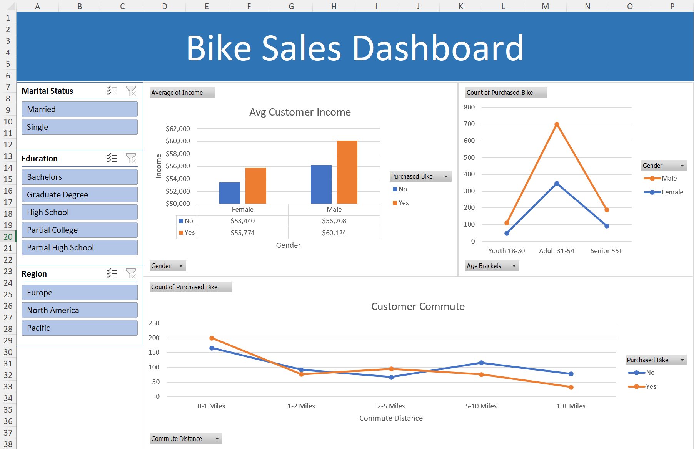

# Excel Bike Sales Dashboard

This repository contains a portfolio project where I built an interactive Excel dashboard to analyze bike sales data using pivot tables.

## Table of Contents

- [Overview](#overview)
- [Dashboard Preview](#dashboard-preview)
- [Project Missions](#project-missions)
- [How to Use](#how-to-use)
- [Key Features](#key-features)
- [License](#license)

## Overview

The dashboard was created to demonstrate my skills in data analysis and Excel. It transforms raw bike sales data into a dynamic view of key metrics and trends.

## Dashboard Preview

## Project Missions

- **Setting up and Cleaning Data:** Preparing raw data for analysis.
- **Making Pivot Tables:** Summarizing data effectively.
- **Creating a Dashboard:** Building a visual interface to display insights.
- **Adding Filter Buttons:** Enhancing interactivity for data exploration.

## How to Use

1. **Download the Project:** Clone or download the repository.
2. **Open in Excel:** Open the `Excel Project.xlsx` file in Microsoft Excel.
3. **Interact:** Use the built-in pivot tables and filters to explore the bike sales data.

## Key Features

- **User-Friendly Interface:** Clean design for straightforward data interpretation.
- **Dynamic Analysis:** Adjust filters and parameters to see updated insights.
- **Data-Driven Decisions:** Identify sales trends, top products, and regional performance.

## License

This repository is licensed under the MIT License. See the [LICENSE](LICENSE) file for more details.

